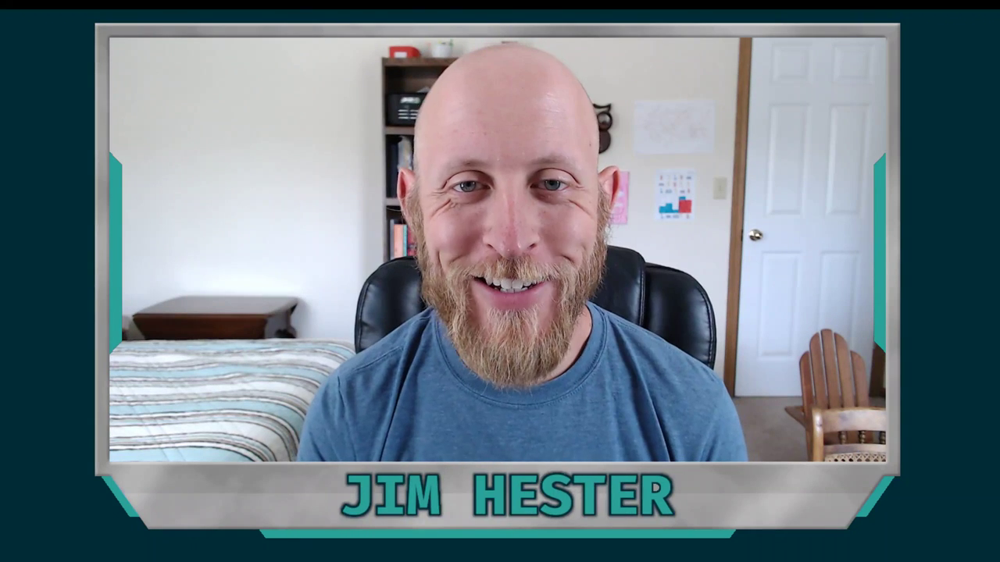
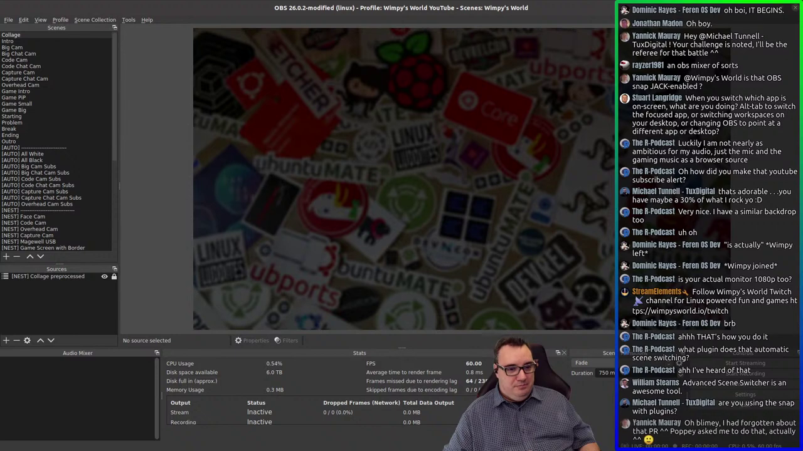
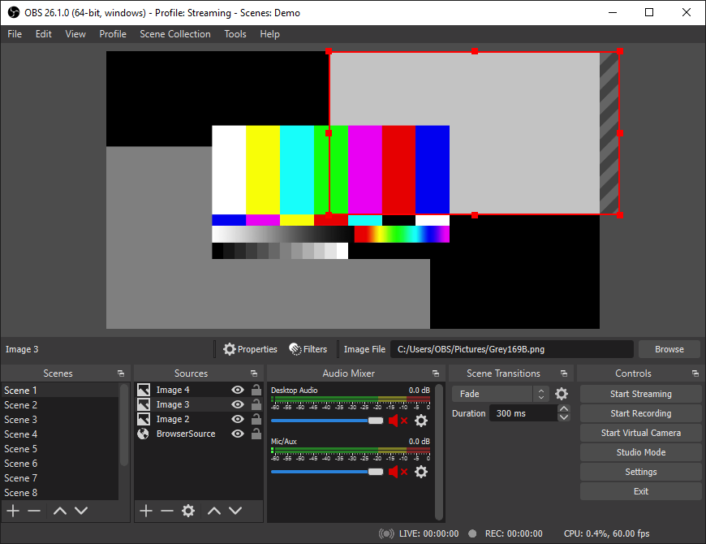

```{r setup, include=FALSE}
options(htmltools.dir.version = FALSE)
knitr::opts_chunk$set(
  fig.width=9, fig.height=3.5, fig.retina=3,
  out.width = "100%",
  cache = FALSE,
  echo = TRUE,
  message = FALSE, 
  warning = FALSE,
  fig.show = TRUE,
  hiline = TRUE
)

library(icons)
```

```{r xaringan-themer, include=FALSE, warning=FALSE}
library(xaringanthemer)
style_mono_light(
  base_color = "#23395b"
)
```

```{r xaringan-tile-view, echo=FALSE}
xaringanExtra::use_tile_view()
```

```{r xaringan-animate-all, echo=FALSE}
#xaringanExtra::use_animate_all("slide_left")
```

```{r xaringanExtra-freezeframe, echo=FALSE}
xaringanExtra::use_freezeframe()
```

## Brainstorm

* Current times accelerated the push for media content
* Open source tools combined with robust platforms empower you to create
your own media garden of content
* Many possibilities for the type of content
* Today we focus on audio/video production
* Phases of content production
   * Preparation
   * Recording
   * Post-production & Release

---

## Why not blogging?

It is not either/or, in fact it is good to have both!

---
background-image: url(img/mantas-hesthaven-_g1WdcKcV3w-unsplash.jpg)
background-size: cover
class: center, top

---
background-image: url(img/shiny_post_screenshot.png)
background-size: cover
class: center, bottom

#### [community.rstudio.com/t/hotshots-racing-random-driver-car-app-shiny-contest-submission/104927](https://community.rstudio.com/t/hotshots-racing-random-driver-car-app-shiny-contest-submission/104927)

---
class: center, bottom


#### [youtube.com/watch?v=1rBipvBuWL4](https://www.youtube.com/watch?v=1rBipvBuWL4)

---

## A clear path forward

--

.pull-left[


[youtube.com/channel/UC3mcThQVORlwCY4k1vB0FmQ](https://www.youtube.com/channel/UC3mcThQVORlwCY4k1vB0FmQ)

]

--

.pull-right[


[youtube.com/watch?v=mduyk66lvb0](https://www.youtube.com/watch?v=mduyk66lvb0)
]

---

## OBS Studio

.pull-left[
- Cross platform
- Slightly intimidating at first
- Can be as simple or complex setup as you like
- Immense flexibility via plugins (much like R packages)
- Scenes are like a list object (nested scenes)
- Automation possible with obs-cli
]

.pull-right[

]

---

# Playing with CSS

**TODO** Use these to illustrate how sources and scenes are like lists and vector elements

.list-box[Welcome]

<style>
.list-box {
  border: 5px solid black;
  background-color: #4D8DC9;
  height: 400px;
  width: 1000px;
  position: absolute;
  bottom: 50px;
  right: 100px;
  font-size: 2.2em;
  text-align: center;
}
</style>

---

## OBS Parallels to `r icon_style(fontawesome("r-project"), fill = "blue")`

+ Base install has a lot of built-in features already to get you started
+ plugins can enhance your experience developing and serving streams, much like community packages in R
+ Organizing the building blocks of your setup with scenes, which contains sources and can even contain more scenes. This is like the list object in R

---

## Tips for using OBS

* Audio devices in dedicated scenes
* Back up your settings regularly
* Always do test recordings whenever you change levels or scene layouts
* unload images and other media sources when not using their associated scenes
* If streaming to YouTube, take advantage of doing an unlisted stream so you can mimic what it will be like for the real thing
* Lock sources when finished placing them, so you don't accidently move them
* If doing both streaming and recording, highly recommended to use a graphics card to offload encoding (I use an NVidia card in my streaming computer)

Link to video when ready

---


## Audacity

* One of the first open-source audio recorder/editors used in podcasting
* Cross-platform
* Recently achieved version 3
* Many built-in plugins for noise reduction, fade in/out, multi-track editing

---

## VOD Ninja

* Uses webRTC and works well with Chrome-based browsers
* No additional software required
* Customize options via query parameters in the URL
* I use it with my shiny dev series interviews

---

## Shotcut

* A premier open-source video editor
* Reference implementation of the MLT standard (look this up)
* Many plugins and filters included for audio/video customization
* Can leverage hardware for faster encoding

---

## Podcast hosting

* I have overall good experience with Fireside
* Other options exist

---

## Video hosting/streaming

* The major players are Twitch and YouTube
* Emerging platforms that are decentralized: PeerTube
* A vibrant and growing community of R and data science streamers seems to be happening more on Twitch these days

---

## Typography

Text can be **bold**, _italic_, ~~strikethrough~~, or `inline code`.

[Link to another slide](#colors).

### Lorem Ipsum

Dolor imperdiet nostra sapien scelerisque praesent curae metus facilisis dignissim tortor. 
Lacinia neque mollis nascetur neque urna velit bibendum. 
Himenaeos suspendisse leo varius mus risus sagittis aliquet venenatis duis nec.

- Dolor cubilia nostra nunc sodales

- Consectetur aliquet mauris blandit

- Ipsum dis nec porttitor urna sed

---
name: colors

## Colors

- <span style="color: var(--text-color)">Text Color</span>

- <span style="color: var(--header-color); font-family: var(--header-font-family);">Header Color</span>

- <span style="color: var(--link-color)">Link Color</span>

- <span style="color: var(--text-bold-color); font-weight: bold;">Bold Color</span>

- `inline code color`

---

# Big Topic or Inverse Slides `#`

## Slide Headings `##`

### Sub-slide Headings `###`

#### Bold Call-Out `####`

This is a normal paragraph text. Only use header levels 1-4.

##### Possible, but not recommended `#####`

###### Definitely don't use h6 `######`

---
class: inverse center middle

# Topic Changing Interstitial

--

```
class: inverse center middle
```

---
layout: true

## Blocks

---

### Blockquote

> This is a blockquote following a header.
>
> When something is important enough, you do it even if the odds are not in your favor.

---

### Code Blocks

#### R Code

```{r eval=FALSE}
ggplot(gapminder) +
  aes(x = gdpPercap, y = lifeExp, size = pop, color = country) +
  geom_point() +
  facet_wrap(~year)
```

#### JavaScript

```js
var fun = function lang(l) {
  dateformat.i18n = require('./lang/' + l)
  return true;
}
```

---

### More R Code

```{r eval=FALSE}
dplyr::starwars %>% dplyr::slice_sample(n = 4)
```

---

```{r message=TRUE}
cli::cli_alert_success("It worked!")
```

--

```{r message=TRUE}
message("Just a friendly message")
```

--

```{r warning=TRUE}
warning("This could be bad...")
```

--

```{r error=TRUE}
stop("I hope you're sitting down for this")
```


---
layout: true

## Tables

---

```{r}
tibble::as_tibble(mtcars)
```

---

```{r}
knitr::kable(head(mtcars), format = 'html')
```

---

```{r}
DT::datatable(head(mtcars), fillContainer = FALSE, options = list(pageLength = 4))
```

---
layout: true

## Lists

---

.pull-left[
#### Here is an unordered list:

*   Item foo
*   Item bar
*   Item baz
*   Item zip
]

.pull-right[

#### And an ordered list:

1.  Item one
1.  Item two
1.  Item three
1.  Item four
]

---

### And a nested list:

- level 1 item
  - level 2 item
  - level 2 item
    - level 3 item
    - level 3 item
- level 1 item
  - level 2 item
  - level 2 item
  - level 2 item
- level 1 item
  - level 2 item
  - level 2 item
- level 1 item

---

### Nesting an ol in ul in an ol

- level 1 item (ul)
  1. level 2 item (ol)
  1. level 2 item (ol)
    - level 3 item (ul)
    - level 3 item (ul)
- level 1 item (ul)
  1. level 2 item (ol)
  1. level 2 item (ol)
    - level 3 item (ul)
    - level 3 item (ul)
  1. level 4 item (ol)
  1. level 4 item (ol)
    - level 3 item (ul)
    - level 3 item (ul)
- level 1 item (ul)

---
layout: true

## Plots

---

```{r plot-example}
library(ggplot2)
(g <- ggplot(mpg) + aes(hwy, cty, color = class) + geom_point())
```

---

```{r plot-example-themed}
g + xaringanthemer::theme_xaringan(text_font_size = 16, title_font_size = 18) +
  ggtitle("A Plot About Cars")
```

---
layout: false

## Square image

<center></center>

.footnote[GitHub Octocat]

---

### Wide image


.footnote[Wide images scale to 100% slide width]

---

## Two images

.pull-left[

]

.pull-right[

]

---

### Definition lists can be used with HTML syntax.

<dl>
<dt>Name</dt>
<dd>Godzilla</dd>
<dt>Born</dt>
<dd>1952</dd>
<dt>Birthplace</dt>
<dd>Japan</dd>
<dt>Color</dt>
<dd>Green</dd>
</dl>

---
class: center, middle

# Thanks!

Slides created via the R packages:

[**xaringan**](https://github.com/yihui/xaringan)<br>
[gadenbuie/xaringanthemer](https://github.com/gadenbuie/xaringanthemer)

The chakra comes from [remark.js](https://remarkjs.com), [**knitr**](http://yihui.name/knitr), and [R Markdown](https://rmarkdown.rstudio.com).
