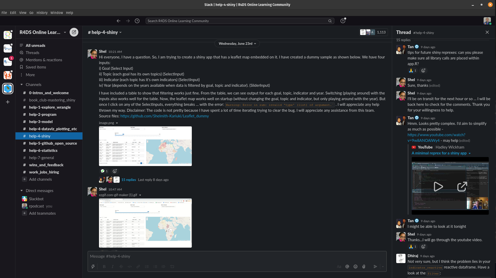
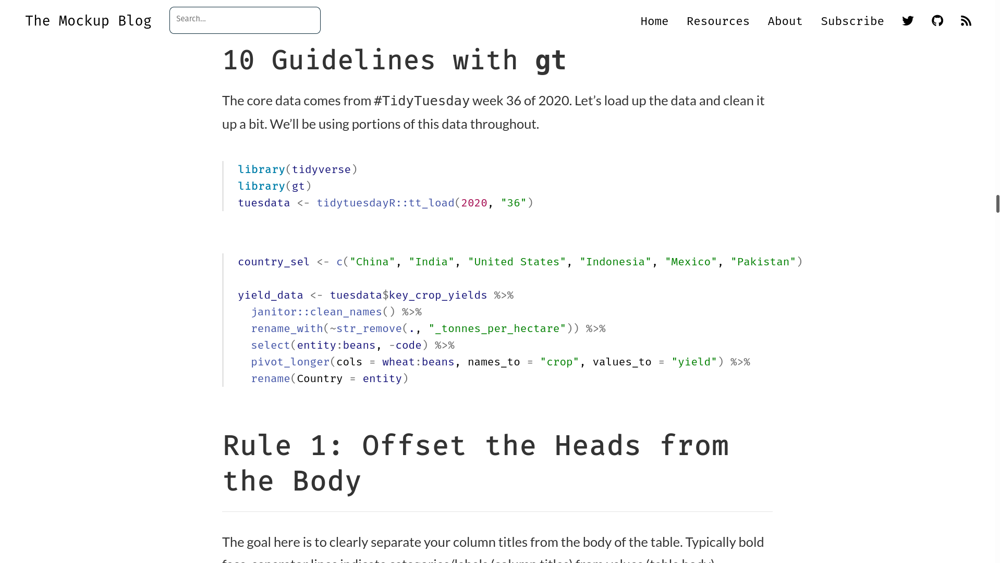
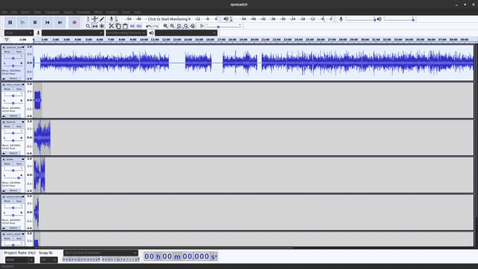
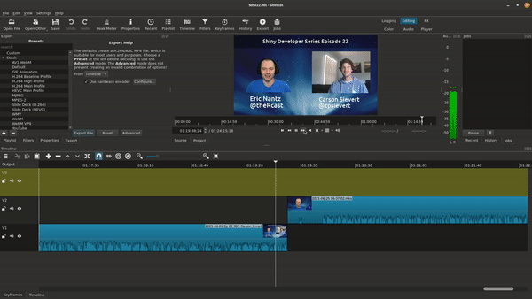

```{r setup, include=FALSE}
options(htmltools.dir.version = FALSE)
knitr::opts_chunk$set(
  fig.width=9, fig.height=3.5, fig.retina=3,
  out.width = "100%",
  cache = FALSE,
  echo = TRUE,
  message = FALSE, 
  warning = FALSE,
  fig.show = TRUE,
  hiline = TRUE
)

library(icons)
library(magrittr)
library(jsonlite)
library(purrr)
library(dplyr)
```

```{r xaringan-themer, include=FALSE, warning=FALSE}
library(xaringanthemer)
style_mono_light(
  base_color = "#23395b"
)
```

```{r xaringan-tile-view, echo=FALSE}
xaringanExtra::use_tile_view()
```

```{r xaringan-animate-all, echo=FALSE}
#xaringanExtra::use_animate_all("slide_left")
```

```{r xaringanExtra-freezeframe, echo=FALSE}
xaringanExtra::use_freezeframe()
```

## Contributing to the R community



The R for Data Science Slack Community

---

## Contributing to the R community



The Mockup Blog authored by Thomas Mock, written with the `{distill}` package.

---
background-image: url(img/mantas-hesthaven-_g1WdcKcV3w-unsplash.jpg)
background-size: cover
class: center, top

# The Destination (and Journey)
---
background-image: url(img/shiny_post_screenshot.png)
background-size: cover
class: center, bottom

#### [community.rstudio.com/t/hotshots-racing-random-driver-car-app-shiny-contest-submission/104927](https://community.rstudio.com/t/hotshots-racing-random-driver-car-app-shiny-contest-submission/104927)

---
class: center, bottom


#### [youtube.com/watch?v=1rBipvBuWL4](https://www.youtube.com/watch?v=1rBipvBuWL4)

---

# The Seeds are Planted

--

.pull-left[

#### Jim Hester's R Development Video Tutorials

[youtube.com/channel/UC3mcThQVORlwCY4k1vB0FmQ](https://www.youtube.com/channel/UC3mcThQVORlwCY4k1vB0FmQ)

]

--

.pull-right[

#### Martin Wimpress' Dev Channel

[youtube.com/watch?v=mduyk66lvb0](https://www.youtube.com/watch?v=mduyk66lvb0)
]

--

.center[
The commonality: Each produced media content with OBS!
]

---

## OBS Studio

.pull-left[
- Cross platform streaming and video production application
- Slightly intimidating at first
- Can be as simple or complex setup as you like
- Immense flexibility via plugins (much like R packages)
- Scenes are like a list object (nested scenes)
- Automation and integrations possible with open APIs
]

.pull-right[

]

---

# My Welcome Scene

.welcome-box[]

--

.image-location[
`r icons::fontawesome("image") %>% icons::icon_style(., fill = "#34ebc0", scale = 8)`
]

.obs-image[

]

--

.footer-location[
`r icons::fontawesome("newspaper") %>% icons::icon_style(., fill = "#34ebc0", scale = 8)`
]

.obs-image[

]

--

.camera-location[
`r icons::fontawesome("camera") %>% icons::icon_style(., fill = "#34ebc0", scale = 8)`
]

.mic-location[
`r icons::fontawesome("microphone") %>% icons::icon_style(., fill = "#34ebc0", scale = 8)`
]

.obs-image[

]

<style>
.welcome-box {
  border: 5px solid black;
  background-color: #4D8DC9;
  height: 420px;
  width: 400px;
  position: absolute;
  bottom: 110px;
  right: 750px;
  font-size: 2.2em;
  text-align: center;
}

.camera-location {
  position: absolute;
  bottom: 340px;
  right: 960px;
}

.image-location {
  position: absolute;
  bottom: 150px;
  right: 980px;
}

.mic-location {
  position: absolute;
  bottom: 340px;
  right: 800px;
}

.footer-location {
  position: absolute;
  bottom: 150px;
  right: 770px;
}

.obs-image {
  height: 500px;
  width: 600px;
  position: absolute;
  bottom: 20px;
  right: 100px;
}

</style>

---

# The Building Blocks of OBS

--

.pull-left[
  ## Sources

  * Individual components to be captured or displayed in your production
  * Examples: Camera, audio inputs, screen capture, window capture, media files, and much more

]

.pull-right[
  ## Scenes

  * A collection of one or more sources
  * Ability to show/hide sources as needed
  * No (theoritical) limitation on the number of sources inside a scene
]

--

### How to effectively organize your OBS setup?

---

# The connections with R

### __Sources__ = __(Specialized) Vectors__: A special type of object that may have its own custom attributes and specialties.

### __Scenes__ = __Lists__: A container of objects, including (potentially) other scenes/lists!

---

# Inside the Welcome Scene

Add more here

---


## OBS Parallels to `r icon_style(fontawesome("r-project"), fill = "blue")`

+ Base install has a lot of built-in features already to get you started
+ plugins can enhance your experience developing and serving streams, much like community packages in R
+ Organizing the building blocks of your setup with scenes, which contains sources and can even contain more scenes. This is like the list object in R

---

## Tips for using OBS

* Audio devices in dedicated scenes
* Back up your settings regularly
* Always do test recordings whenever you change levels or scene layouts
* unload images and other media sources when not using their associated scenes
* If streaming to YouTube, take advantage of doing an unlisted stream so you can mimic what it will be like for the real thing
* Lock sources when finished placing them, so you don't accidently move them
* If doing both streaming and recording, highly recommended to use a graphics card to offload encoding (I use an NVidia card in my streaming computer)

Link to video when ready

---

# Audacity

.left-column[
* One of the first open-source audio recorder/editors used in podcasting
* Cross-platform
* Recently achieved version 3
* Many built-in plugins for noise reduction, fade in/out, multi-track editing
]

.right-column[

]

---

# Shotcut

.left-column[
* A premier open-source video editor
* Reference implementation of the MLT standard (look this up)
* Many plugins and filters included for audio/video customization
* Can leverage hardware for faster encoding
]

.right-column[
[https://www.shotcut.org](https://www.shotcut.org/)


]

---


## VOD Ninja

* Uses webRTC and works well with Chrome-based browsers
* No additional software required
* Customize options via query parameters in the URL
* I use it with my shiny dev series interviews

### TODO: Add screenshot

---

## Podcast hosting

* I have overall good experience with Fireside
* Other options exist

---

## Video hosting/streaming

* The major players are Twitch and YouTube
* Emerging platforms that are decentralized: PeerTube
* A vibrant and growing community of R and data science streamers seems to be happening more on Twitch these days

---


# Playing with CSS

**TODO** Use these to illustrate how sources and scenes are like lists and vector elements

.list-box[Welcome]

<style>
.list-box {
  border: 5px solid black;
  background-color: #4D8DC9;
  height: 400px;
  width: 1000px;
  position: absolute;
  bottom: 50px;
  right: 100px;
  font-size: 2.2em;
  text-align: center;
}
</style>
