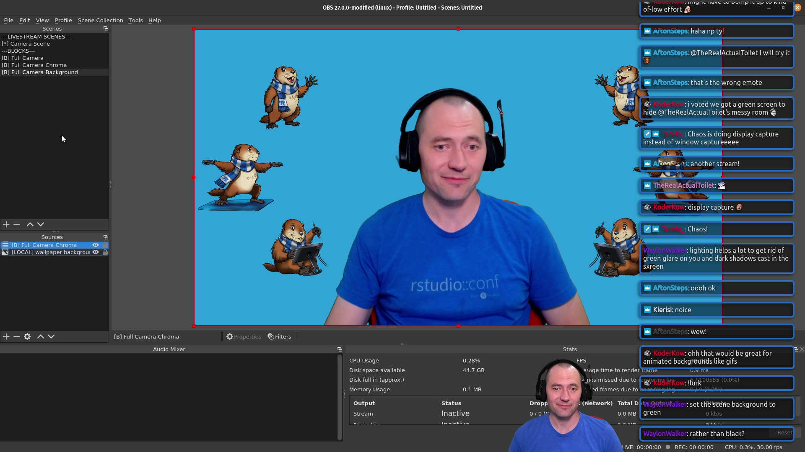

```{r setup, include=FALSE}
options(htmltools.dir.version = FALSE)
knitr::opts_chunk$set(
  fig.width=9, fig.height=3.5, fig.retina=3,
  out.width = "100%",
  cache = FALSE,
  echo = TRUE,
  message = FALSE, 
  warning = FALSE,
  fig.show = TRUE,
  hiline = TRUE
)

library(icons)
library(magrittr)
library(jsonlite)
library(purrr)
library(dplyr)

# source supporting scripts
source("utils.R")

# create nested tibble of obs scene/sources metadata
obs_df <- create_obs_df("data/shinydevseries_scene_collection_livestream_1080p.json")
```

```{r xaringan-themer, include=FALSE, warning=FALSE}
library(xaringanthemer)
style_mono_light(
  base_color = "#23395b"
)
```

```{r xaringan-tile-view, echo=FALSE}
xaringanExtra::use_tile_view()
```

```{r xaringan-animate-all, echo=FALSE}
#xaringanExtra::use_animate_all("slide_left")
```

```{r xaringanExtra-freezeframe, echo=FALSE}
xaringanExtra::use_freezeframe()
```

class: image-sidebar-right
background-image: url(https://source.unsplash.com/9FwrfeM2XIY/600x681)
background-size: 600px 681px
background-position: right

.pull-left[
.center[
## How Open-Source and R Enable State-of-the-Art Media Production

### Eric Nantz
### Statistician & Content Creator
### UseR! 09-July-2021

`r icons::fontawesome("github")` [rpodcast](https://github.com/rpodcast) | `r icons::fontawesome("twitter")` [@theRcast](https://twitter.com/thercast) | `r icons::fontawesome("twitch")` [rpodcast](https://twitch.tv/rpodcast)

`r emo::ji("microphone")` [r-podcast.org](https://www.r-podcast.org)
`r icons::fontawesome("youtube")` [shinydevseries.com](https://youtube.com/shinydeveloperseries) <br>
`r emo::ji("newspaper")` [rweekly.org](https://rweekly.org)
]


]

---
class: center, middle

### The R for Data Science Slack Community


???
The Mockup Blog authored by Thomas Mock, written with the `{distill}` package.
---
class: center, middle

### Sharing insights via blogging


---
background-image: url(img/mantas-hesthaven-_g1WdcKcV3w-unsplash.jpg)
background-size: cover
class: center, top

## The Destination (and Journey)
---
background-image: url(img/shiny_post_screenshot.png)
background-size: cover
class: center, bottom

#### [community.rstudio.com/t/hotshots-racing-random-driver-car-app-shiny-contest-submission/104927](https://community.rstudio.com/t/hotshots-racing-random-driver-car-app-shiny-contest-submission/104927)

---
class: center, middle


#### [youtube.com/watch?v=1rBipvBuWL4](https://www.youtube.com/watch?v=1rBipvBuWL4)

---
class: center, top

# The Seeds are Planted

--

.pull-left[

#### Jim Hester's R Development Video Tutorials

[youtube.com/channel/UC3mcThQVORlwCY4k1vB0FmQ](https://www.youtube.com/channel/UC3mcThQVORlwCY4k1vB0FmQ)

]

--

.pull-right[

#### Martin Wimpress' Dev Channel

[youtube.com/watch?v=mduyk66lvb0](https://www.youtube.com/watch?v=mduyk66lvb0)
]

--

.center[
### Each produced with OBS!
]

???
OBS Stuff
- plugins are like R packages
- automation and integration possible with open APIs
---

.center[
## OBS Studio
]

.left-column[
- Cross-platform audio & video production
- The **de-facto standard** for streaming content to YouTube & Twitch
- Immense flexibility via plugins
- Most tutorials are targeted to the gaming community
]

.right-column[
.center[

[obsstudio.com](https://obsstudio.com)
]
]

---

.center[
## The Building Blocks of OBS
]


--

.pull-left[
.center[
## Sources
]
* Individual components with their own unique **attributes** to be captured or displayed in your production
* Examples: Camera, audio inputs, screen capture, window capture, media files, and much more
]

--

.pull-right[
.center[
## Scenes
]
* **Collection** of one or more sources
* **Any** type of source can be included, including other **scenes!**
]

--

.center[
# `r emo::ji("thinking")` That sounds quite familiar...
]
 

---
.center[
# The connections with `r icon_style(fontawesome("r-project"), fill = "blue")`
]

--

.pull-left[
.center[
## Vectors
]
* Individual components with their own unique **attributes** 
* Examples: character, numeric, boolean
]

--

.pull-right[
.center[
## Lists
]
* **Collection** of one or more objects
* **Any** type of object can be included, including other **lists!**
]


---

.center[
## My Welcome Scene
]

.welcome-box[]

--

.image-location[
`r icons::fontawesome("image") %>% icons::icon_style(., fill = "#34ebc0", scale = 8)`
]

.obs-image[

]

--

.footer-location[
`r icons::fontawesome("newspaper") %>% icons::icon_style(., fill = "#34ebc0", scale = 8)`
]

.obs-image[

]

--

.camera-location[
`r icons::fontawesome("camera") %>% icons::icon_style(., fill = "#34ebc0", scale = 8)`
]

.mic-location[
`r icons::fontawesome("microphone") %>% icons::icon_style(., fill = "#34ebc0", scale = 8)`
]

.obs-image[

]

???
## OBS Parallels to `r icon_style(fontawesome("r-project"), fill = "blue")`
+ Base install has a lot of built-in features already to get you started
+ plugins can enhance your experience developing and serving streams, much like community packages in R
+ Organizing the building blocks of your setup with scenes, which contains sources and can even contain more scenes. This is like the list object in R


---

.center[
# My Welcome Scene
]

.welcome-box[]

.image-location[
`r icons::fontawesome("image") %>% icons::icon_style(., fill = "#34ebc0", scale = 8)`
]

.footer-location[
`r icons::fontawesome("newspaper") %>% icons::icon_style(., fill = "#34ebc0", scale = 8)`
]

.camera-location[
`r icons::fontawesome("camera") %>% icons::icon_style(., fill = "#34ebc0", scale = 8)`
]

.mic-location[
`r icons::fontawesome("microphone") %>% icons::icon_style(., fill = "#34ebc0", scale = 8)`
]

.pull-right[

```{r welcome_data, echo=FALSE}
# filter for welcome scene from computed data frame
welcome_df <- obs_df %>%
  filter(name == "[*] Only Me Welcome")


listviewer::jsonedit(welcome_df$actual_sources_named[[1]], width = 500, height = 400)


```
]


???
other quick Tips
* Audio devices in dedicated scenes
* Back up your settings regularly
* Always do test recordings whenever you change levels or scene layouts
* unload images and other media sources when not using their associated scenes
* If streaming to YouTube, take advantage of doing an unlisted stream so you can mimic what it will be like for the real thing
* Lock sources when finished placing them, so you don't accidently move them
* If doing both streaming and recording, highly recommended to use a graphics card to offload encoding (I use an NVidia card in my streaming computer)
---

.center[
## Quick Tips with OBS
]

.pull-left[
* Take advantage of **nested** scenes!
* Unload any media sources not shown in current scene
* Leverage **browser sources** for dynamic web-based alerts and content
]

.pull-right[
.center[

[youtube.com/watch?v=fkvQ_lAGvFQ](https://www.youtube.com/watch?v=fkvQ_lAGvFQ)
]
]

--

.center[
### More video tutorials on using OBS coming soon!
]


---

```{r vdosetup, echo=FALSE}
iframe_width <- params$iframe_width
iframe_height <- params$iframe_height

if (params$live) {
  #construct VDO Ninja url
  vdo_url <- glue::glue("https://vdo.ninja/?view={vdo_id}&scene&room={room_id}", vdo_id = params$vdo_id, room_id = params$room_id)

  # construct iframe object
  embed_html <- htmltools::HTML(glue::glue("<iframe width='{iframe_width}' height='{iframe_height}' src='{vdo_url}' frameborder='0'>"), .noWS = "outside")

  # construct header for slide
  slide_header <- "This is from VDO Ninja!"

} else {
  # construct iframe object
  embed_html <- htmltools::HTML(glue::glue(""))

  # construct header for slide
  slide_header <- "This could be from VDO Ninja!"
}

```
.center[
## ViDeO Ninja
]

.left-column[
* Free web service for audio/video sharing
* Powered by web RTC and peer-to-peer technology
* Easily imported into OBS as **browser sources**
* The engine behind my Shiny Developer Series interviews!
]

.right-column[
.center[

[shinydevseries.com/ep21](https://shinydevseries.com/ep21)
]

]

---
class: center, top

### `r slide_header`

`r embed_html`

---
background-image: url(https://source.unsplash.com/1l2waV8glIQ)
background-size: contain
class: center, top

.white[
# Community Wins
]

---

.center[
## A (Live) Shiny Reprex! 
]

.pull-left[
.center[
<blockquote class="twitter-tweet"><p lang="en" dir="ltr">A short and random <a href="https://twitter.com/hashtag/rstats?src=hash&amp;ref_src=twsrc%5Etfw">#rstats</a> twitch stream: debugging a Shiny app problem found on <a href="https://twitter.com/R4DScommunity?ref_src=twsrc%5Etfw">@R4DScommunity</a> and narrating my thoughts - app by <a href="https://twitter.com/Shel_Kariuki?ref_src=twsrc%5Etfw">@Shel_Kariuki</a>! <br><br>Live now: <a href="https://t.co/byE0SlXj3e">https://t.co/byE0SlXj3e</a></p>&mdash; Tan (@_TanHo) <a href="https://twitter.com/_TanHo/status/1407834617944621056?ref_src=twsrc%5Etfw">June 23, 2021</a></blockquote> <script async src="https://platform.twitter.com/widgets.js" charset="utf-8"></script> 
[twitter.com/_TanHo/status/1407834617944621056](https://twitter.com/_TanHo/status/1407834617944621056)
]
]

.pull-right[
.center[


[twitch.tv/videos/1065545295](https://www.twitch.tv/videos/1065545295)
]
]

---

.center[
## The `r icon_style(fontawesome("r-project"), fill = "blue")` & Data Science StreameRs Emerge!

[www.jessemaegan.com/blog/2021-05-28-data-science-twitch-streamers-round-up](https://www.jessemaegan.com/blog/2021-05-28-data-science-twitch-streamers-round-up/)
]

<iframe width = '1280' height = '420' src="https://www.jessemaegan.com/blog/2021-05-28-data-science-twitch-streamers-round-up/#the-streaming-data-science-community">


